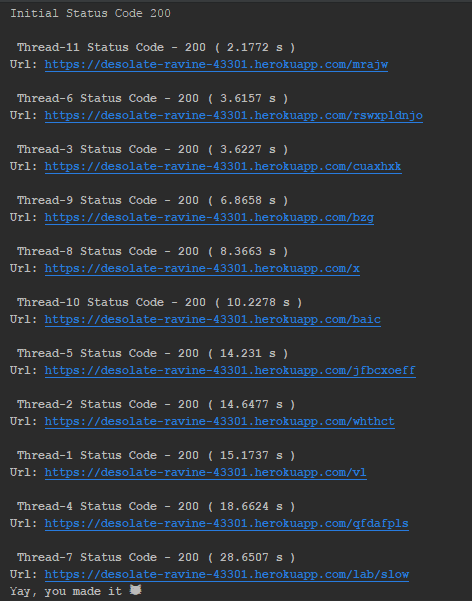
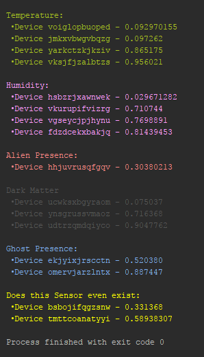

## HTTP Client with concurrency superpowers

Study OSI model, HTTP and implement a client app which can do multiple HTTP requests concurrently.

### Prerequisites

- Read about OSI model (definition, basic info)
- Read about (de)serialization
- Concurrency (definition, primitives etc)

## Tasks
### Metrics Aggregator

Your new client is a super secret organization which needs to collect a bunch of different metrics from an object and aggregate them.
An object is a real location that has some devices which collects data from sensors.
Each device has an `id`, `type` or `sensor_type` and a `value` which describes device's state.
So, `metrics` is just a fancy word for data which describes state of your object from a perspective (e.g. temperature, air pressure etc).

**Device/Sensor Types:**
- Temperature sensor - `0`
- Humidity sensor - `1`
- Motion sensor - `2`
- Alien Presence detector - `3`
- Dark Matter detector - `4`

However, there are some problems about those devices:
- Each device has its own URL and can be accessed only using a secret key
- Devices can return values in different formats (JSON, XML, CSV)
- Depending on format, a device can return multiple values (e.g. a box which has multiple sensors)
- Sometimes a device can respond you in up to `29 sec.`
- And the most important constraint - your secret key is valid only `30 sec.`
  (because the organization is super secret and don't want to leak access keys).

**Examples of some metrics:**

A single device in JSON format:
```
{
    "device_id": "123",
    "sensor_type": 0,
    "value": 100
}
```

A single device in XML format:
```
<?xml version="1.0" ?>
<device id="321">
    <type>1</type>
    <value>0.5</value>
</device>
```

A device with multiple sensors in CSV format:
```
device_id;sensor_type;value
132;3;0
132;4;50
```

Here's what functionality your app must offer:
1. Request your secret key at `https://desolate-ravine-43301.herokuapp.com/`, in response you'll receive a list of URLs (for each device)
2. Using your secret key, request data from all devices concurrently
3. If you get an error related to your access key, go back to **step 1** and retry
4. Parse data from all devices
5. Aggregate all responses ordering by sensor type .

## Results


