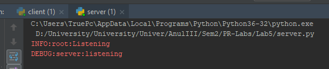
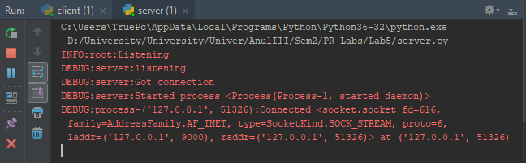
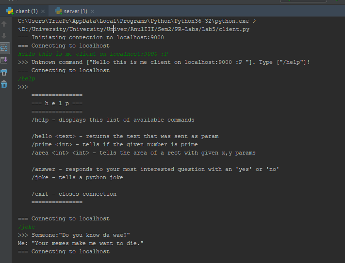
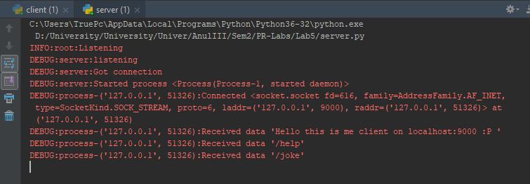
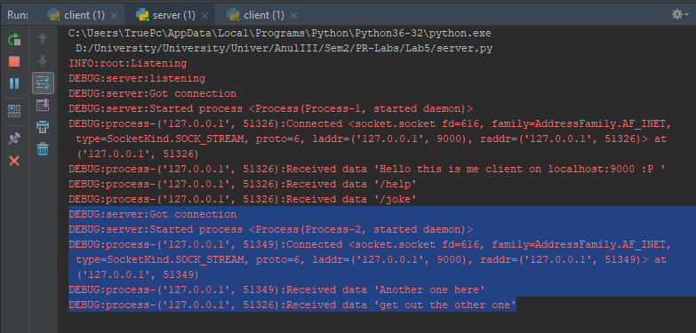

<details>
<summary>Task</summary>
## TCP

Elaborarea unei aplicații Client - Server cu scopul studierii
protocolului de la nivelul de transport - TCP.

### Prerequisites

- VCS (Version Control System) Git - vezi [info din procesul de susținere](submission-process.md);
- Limbajul de programare: nu este restricționat. Însă să recomandă un limbaj dinamic cu REPL*.
- Cunoștințe despre: [modelul OSI](https://en.wikipedia.org/wiki/OSI_model), IP

Note:
- Informație despre git și linkuri utile găsești în [procesul de sustinere](submission-process.md);

### Obiective

- Studierea nivelului de transport în rețea și TCP/IP;
- Studierea BSD sockets API;
- Elaborarea unei aplicații client-server.

### Sarcina de bază (5 - 7)

Primul pas logic este să studiați interfața oferită de limbaj 
pentru lucru cu [BSD sockets](http://en.wikipedia.org/wiki/Bsd_sockets).

Scopul este să implementați o aplicație [client-server](https://en.wikipedia.org/wiki/Client%E2%80%93server_model), deci 
următorul pas este stabilirea protocolului de comunicare între 
client și server.

#### Formatul mesajelor
Pentru a ușura acest proces, se stabilește următorul format al mesajelor:
- Comenzile de la client încep cu `/`
- Numele comenzii poate conține `A-Za-z0-9_`
  **De exemplu:** `/help`
- Daca comanda acceptă parametri, atunci după comanda urmeaza spațiu si restul datelor.
  **Exemplu:** `/hello John`
- Dacă serverul primește o comandă invalidă - se răspunde cu un mesaj informativ.

##### Protocolul de comunicare
Aceasta și este prima sarcină - să descrieți protocolul de comunicare între client și server.
Acest document trebuie păstrat în repozitoriu și inclus în raport.
Documentul trebuie să fie plain-text, se recomandă utilizarea [markdown](https://guides.github.com/features/mastering-markdown/).

Documentul cu specificația protocolului trebuie să conțină:
- Formatul mesajelor
- Comenzile suportate de server
- Exemple de răspuns la fiecare comandă

#### Comenzile acceptate de server
**Comenzile obligatorii care trebuie să le implementeze serverul:**
- `/help` - răspunde cu o listă a comenzilor suportate și o descriere a fiecărei comenzi;
- `/hello Text` - raspunde cu textul care a fost expediat ca paremetru<
- alte 3 comenzi cu funcțional diferit (e.g. timpul curent, generator de cifre, flip the coin etc)

#### Cerințe pentru sistem
Cerințele de bază pentru aplicație sunt:
- O aplicație client care se conectează la server și permite transmiterea comenzilor;
  - Comenzile sunt introduse de utilizator de la tastatură;
  - Răspunsul primit de la server este afișat utilizatorului.
- O aplicație server care:
  - Acceptă conexiunea de la client la un careva port;
  - Primește comenzile de la client;
  - Transmite un răspuns clientului.

**Constrîngeri:**
- Să se utilizeze **doar** interfața BSD sockets oferită de limbaj/platformă.

#### Exemple

Mai jos găsiți exemple de client și server simple implementate în Python (CPython) 3.
În calitate de client, la fel poate fi utilizat și telnet pentru testare.
Atît clientul, cît și serverul pot fi aplicații simple fără GUI.

- [Exemplu de server în Python](examples/lab5_server.py)
- [Exemplu de client în Python](examples/lab5_client.py)

### Sarcini adiționale (+1 pentru fiecare sarcină)

- Să se implementeze **procesarea concurentă** a mesajelor de la clienți de către server.
  Serverul trebuie să fie capabil să proceseze concurent conexiunile de la mai mulți clienți.
  - Alternativă: Descrieți succint 2 modalități de procesare concurentă a conexiunilor multiple.
    Comparați acele 2 metode și descrieți avantajele/dezavantajele.
    În cazul unei analize complete, **implementarea procesării concurente nu este obligatorie**.
- Dacă serverul primește o comandă invalidă, însă există o altă [comandă similară](https://en.wikipedia.org/wiki/Levenshtein_distance) cu cea invalidă, 
  serverul trebuie să returneze un mesaj care informează despre acea comandă alternativă validă.
  
  E.g. 
  ```
  >>> /hell
  <<< Ouch! "/hell" is an invalid command. Did you mean "/hello <param>"?
  ```
- Dacă serverul primește o comandă specifică, el trebuie să transmită clientului un oarecare fișier (imagine, text file, pdf etc).
  Clientul trebuie să salveze acest fișierul primit (păstrând extensia) și să afișeze calea absolută la locația salvată, sau să deschidă 
  fișierul în previewer-ul suportat de OS.
 </details>
 
### ServerStart


 
### AfterClientConnects
 

 
### UsingServerCommands
 

 
### ServerRecievesTheCommands
 

 
### MoreThanOneConnection
 

  