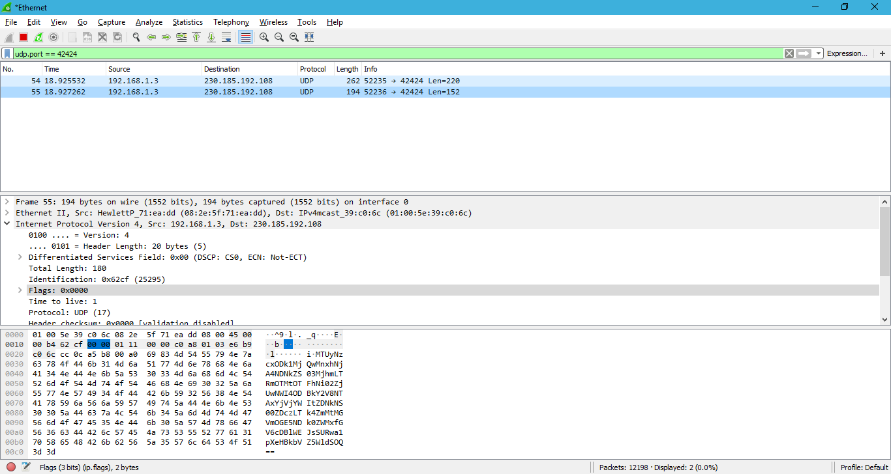

# Laboratory work 6

Open wireshark and select the interface we will be tracking, the interface I use is vEthernet (windows). 
To make work easier close the browser and all applications that are using internet. 
Open the application and select username and hit enter.

Now we need to filter our packets, to do this type `udp` in filter box.
The perfect scenario is that you should have one UDP paket. 
If you have multiple packets and can't find the one you are searcing we will cheat a little and filter it by port. 
The application is using the 42424 port as receiving port for all packets, to filter by port use `tcp.port == 42424`. The following screen is our wireshark window with the packet sent by application.

Now we will try to Decode from base64 what those packet messages mean when we recieved.

###Decoding after a message was transfered in between 2 users:
##packet1
Decode(1): `MTUyNzcxODk1MjQwMHw1MDFiNWNhYi1kM2Q1LTRkNzMtOThmYy0wZWY4YTk0OTRlYzF8YTYwODQzZGUtNzI4Zi00ZjkzLTkxYTYtNmY1MDViODgwZGNlfGV6cDBlWEJsSURwamFHRjBMQ0E2ZEhoMElDSlVTR2x6SUdseklHNXZkQ0JxZFhOMElHRWdjMmx0Y0d4bElHMWxjM05oWjJVdUluMD0=`
Decode(1.2): `1527718952400|501b5cab-d3d5-4d73-98fc-0ef8a9494ec1|a60843de-728f-4f93-91a6-6f505b880dce|ezp0eXBlIDpjaGF0LCA6dHh0ICJUSGlzIGlzIG5vdCBqdXN0IGEgc2ltcGxlIG1lc3NhZ2UuIn0=`
Decoded = `{:type :chat, :txt "THis is not just a simple message."}`
##packet2
Decode(2): `MTUyNzcxODk1MjQwMnxhNjA4NDNkZS03MjhmLTRmOTMtOTFhNi02ZjUwNWI4ODBkY2V8NTAxYjVjYWItZDNkNS00ZDczLTk4ZmMtMGVmOGE5NDk0ZWMxfGV6cDBlWEJsSURwa1pXeHBkbVZ5WldSOQ==`
Decode(2.2): `1527718952402|a60843de-728f-4f93-91a6-6f505b880dce|501b5cab-d3d5-4d73-98fc-0ef8a9494ec1|ezp0eXBlIDpkZWxpdmVyZWR9`
Decoded = `{:type :delivered}`

Here i try inspecting the packets i recieved at the step of creating a new user
#packet1
Decode after the step of user creation: `MTUyNzcyMzAzNTIzOXw2YjlhYjAxMy1mZDBhLTRlZjMtOTcwNS1kYmQ1ODUxNjllMTB8OmFsbHxlenAwZVhCbElEcHZibXhwYm1Vc0lEcDFjMlZ5Ym1GdFpTQWlhMnNpZlE9PQ==`
Decoded: `1527723035239|6b9ab013-fd0a-4ef3-9705-dbd585169e10|:all|ezp0eXBlIDpvbmxpbmUsIDp1c2VybmFtZSAia2sifQ==`
message: `{:type :online, :username "kk"}`
#packet2
Decode after recieving online users currently: `MTUyNzcyMzAzNTI0OXw1MDFiNWNhYi1kM2Q1LTRkNzMtOThmYy0wZWY4YTk0OTRlYzF8NmI5YWIwMTMtZmQwYS00ZWYzLTk3MDUtZGJkNTg1MTY5ZTEwfGV6cDBlWEJsSURwdmJteHBibVVzSURwMWMyVnlibUZ0WlNBaWJXRmpNaUo5`
Decoded: `1527723035249|501b5cab-d3d5-4d73-98fc-0ef8a9494ec1|6b9ab013-fd0a-4ef3-9705-dbd585169e10|ezp0eXBlIDpvbmxpbmUsIDp1c2VybmFtZSAibWFjMiJ9`
message: `{:type :online, :username "mac2"}`

###I will now try to create an user and send an message on his behalf to the mac2.

Creating the user: `{:type :online, :username "crazy potato"}`
Ussid: `e369b064-6463-11e8-adc0-fa7ae01bbebc`
PreEncode: `1527723035239|e369b064-6463-11e8-adc0-fa7ae01bbebc|:all|ezp0eXBlIDpvbmxpbmUsIDp1c2VybmFtZSAiY3JhenkgcG90YXRvIn0=`
Encoded: `MTUyNzcyMzAzNTIzOXxlNDFjZTBiOC02NDYyLTExZTgtYWRjMC1mYTdhZTAxYmJlYmN8OmFsbHxlenAwZVhCbElEcHZibXhwYm1Vc0lEcDFjMlZ5Ym1GdFpTQWlZM0poZW5rZ2NHOTBZWFJ2SW4wPQ==`

Sending his message to mac2 with ussid `501b5cab-d3d5-4d73-98fc-0ef8a9494ec1`:
message: `{:type :chat, :txt "This is a try on sending a message with packets"}`
Encoded message: `ezp0eXBlIDpjaGF0LCA6dHh0ICJUaGlzIGlzIGEgdHJ5IG9uIHNlbmRpbmcgYSBtZXNzYWdlIHdpdGggcGFja2V0cyJ9=`
PreEncode: `1527723035249|e369b064-6463-11e8-adc0-fa7ae01bbebc|501b5cab-d3d5-4d73-98fc-0ef8a9494ec1|ezp0eXBlIDpjaGF0LCA6dHh0ICJUaGlzIGlzIGEgdHJ5IG9uIHNlbmRpbmcgYSBtZXNzYWdlIHdpdGggcGFja2V0cyJ9=`
Encoded: `MTUyNzcyMzAzNTI0OXw1MDFiNWNhYi1kM2Q1LTRkNzMtOThmYy0wZWY4YTk0OTRlYzF8ZTM2OWIwNjQtNjQ2My0xMWU4LWFkYzAtZmE3YWUwMWJiZWJjfGV6cDBlWEJsSURwamFHRjBMQ0E2ZEhoMElDSlVhR2x6SUdseklHRWdkSEo1SUc5dUlITmxibVJwYm1jZ1lTQnRaWE56WVdkbElIZHBkR2dnY0dGamEyVjBjeUo5PQ==`
If you have multiple users and register, you will observe that multiple packets are sent, this happens because after receiving this packet, the app broadcasts packets to all users that are active.

If you followed all the steps correctly you should have received the message inside the app.

